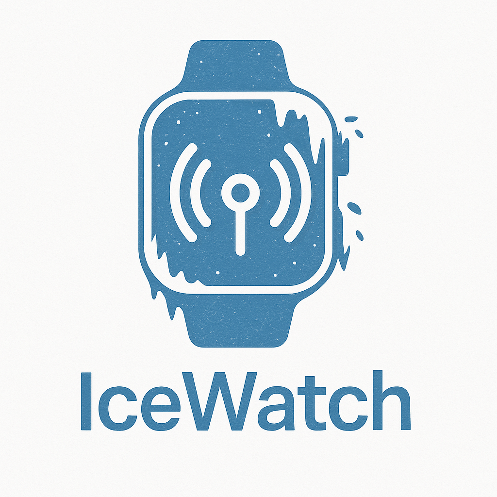

# IceWatch



**IceWatch** is a secure Spring Boot backend designed to proxy and protect audio/video streams served by **Icecast** and **Owncast**. It enables dynamic token-based access control, referer validation, and seamless frontend integration.

---

## 🎯 Features

- 🔐 **Token-based access**: Dynamic tokens tied to referer headers.
- 🧾 **Master token support**: For trusted external systems like mobile apps or portals.
- 🛡️ **Reverse proxy**: Proxies all Owncast and Icecast resources through a single domain.
- 🌐 **CORS configuration**: Supports frontend applications securely.
- ⚙️ **Centralized config**: Easily configurable via `application.properties` or environment variables.

---

## 🛠 Configuration

In `src/main/resources/application.properties`, you can set:
---
```properties
server.port=9090

icewatch.master-token=MASTER_SECRET_TOKEN
icewatch.allowed-domain=https://your-frontend-domain.com
icewatch.owncast-url=http://localhost:8123
icewatch.icecast-stream-url=http://localhost:8000/radio
⚠️ Be sure to change MASTER_SECRET_TOKEN before deploying in production!
```
---
🚀 How It Works
/auth/token: Issues short-lived tokens if the request comes from a valid referer.

/radio: Proxies the Icecast stream, protected by token.

/owncast/**: Proxies Owncast resources and embeds, with protection on sensitive routes.

/radio/metadata: Fetches current song title from Icecast.


🧪 Development
---

```bash
Copier
# Build and run
./mvnw clean package
java -jar target/backend-0.0.1-SNAPSHOT.jar
```
📄 License
---
MIT — free to use, modify, and contribute.
Feel free to submit pull requests or open issues!

# IceWatch Front-end Integration Examples

Below are small code snippets showing how to embed both the audio (Icecast) and video (Owncast) streams into your front-end. Replace the placeholders (`API_BASE`, `your-backend-domain.com`, `your-frontend-domain.com`) with your actual domains.

---

## 1. HTML Structure

Create a simple page with two “post” blocks—one for audio and one for video:

```html
<!DOCTYPE html>
<html lang="en">
<head>
  <meta charset="UTF-8">
  <title>IceWatch Demo</title>
  <style>
    body {
      font-family: sans-serif;
      text-align: center;
      margin: 50px;
      background-color: #f0f2f5;
    }
    .post {
      max-width: 720px;
      margin: 20px auto;
      padding: 25px;
      border: 1px solid #ccc;
      border-radius: 8px;
      background-color: #fff;
      box-shadow: 2px 2px 12px rgba(0,0,0,0.08);
    }
    h2 { margin-top: 0; }
    audio, iframe { width: 100%; border: none; }
    #metadata { margin-top: 10px; font-style: italic; color: #444; }
  </style>
</head>
<body>

  <!-- Audio Block -->
  <div class="post">
    <h2>🎙 Live Audio</h2>
    <div id="player-container">Loading audio…</div>
    <div id="metadata">Loading metadata…</div>
  </div>

  <!-- Video Block -->
  <div class="post">
    <h2>📺 Live Video</h2>
    <div id="video-container">Loading video…</div>
  </div>

  <script src="icewatch-demo.js"></script>
</body>
</html>
```

---

## 2. JavaScript (`icewatch-demo.js`)

```js
const API_BASE = 'https://your-backend-domain.com';

async function fetchToken() {
  const res = await fetch(`${API_BASE}/auth/token`, {
    method: 'GET',
    // This header must match your front-end domain as configured in IceWatch
    headers: { 'Origin': 'https://your-frontend-domain.com' }
  });
  const { token } = await res.json();
  return token;
}

async function setupAudio(token) {
  const audio = document.createElement('audio');
  audio.src = `${API_BASE}/radio?token=${encodeURIComponent(token)}`;
  audio.autoplay = true;
  audio.controls = true;

  const container = document.getElementById('player-container');
  container.innerHTML = '';
  container.appendChild(audio);
}

async function updateMetadata() {
  try {
    const res = await fetch(`${API_BASE}/radio/metadata`);
    const { title } = await res.json();
    document.getElementById('metadata').innerText =
      title ? `Now playing: ${title}` : 'No metadata available.';
  } catch {
    document.getElementById('metadata').innerText = 'Error loading metadata.';
  }
}

async function setupVideo(token) {
  const iframe = document.createElement('iframe');
  iframe.src = `${API_BASE}/owncast/embed/video?token=${encodeURIComponent(token)}`;
  iframe.width = '720';
  iframe.height = '405';
  iframe.allowFullscreen = true;

  const container = document.getElementById('video-container');
  container.innerHTML = '';
  container.appendChild(iframe);
}

async function initPlayers() {
  try {
    const token = await fetchToken();

    await setupAudio(token);
    updateMetadata();
    setInterval(updateMetadata, 15000);

    await setupVideo(token);
  } catch (err) {
    console.error('Initialization error:', err);
    document.getElementById('player-container').innerText = 'Audio load error.';
    document.getElementById('video-container').innerText = 'Video load error.';
  }
}

window.addEventListener('DOMContentLoaded', initPlayers);
```
---

> **Note:**  
> - **`Origin` header** (or `Referer`) must match the domain you’ve whitelisted in your IceWatch backend (`allowed-domain`).  
> - Adjust `API_BASE` to point at your deployed IceWatch service.  

These snippets can be dropped directly into your front-end codebase to quickly integrate secured audio/video streaming.
# Deploying IceWatch as a systemd Service

This guide explains how to deploy IceWatch as a Linux service using `systemd`.  
It assumes you have the JAR built (`icewatch.jar`) and a configuration file (`application.properties`).

---

## 📁 1. Move files to appropriate locations

```bash
sudo mkdir -p /opt/icewatch
sudo mkdir -p /etc/icewatch

# Copy the JAR
sudo cp backend-0.0.1-SNAPSHOT.jar /opt/icewatch/icewatch.jar

# Create and edit the config file
sudo nano /etc/icewatch/application.properties
```

---

## ⚙️ 2. application.properties Example

```properties
server.port=9090
icewatch.master-token=MASTER_SECRET_TOKEN
icewatch.allowed-domain=https://your-frontend-domain.com
icewatch.owncast-url=http://localhost:8123
icewatch.icecast-stream-url=http://localhost:8000/radio
```

---

## 🛠️ 3. Create a systemd service

```bash
sudo nano /etc/systemd/system/icewatch.service
```

Paste the following content:

```ini
[Unit]
Description=IceWatch Radio Proxy
After=network.target

[Service]
Type=simple
User=icewatch
Group=icewatch
WorkingDirectory=/opt/icewatch
ExecStart=/usr/bin/java -jar /opt/icewatch/icewatch.jar --spring.config.location=file:/etc/icewatch/application.properties
Restart=always
RestartSec=5
Environment=JAVA_OPTS=-Xmx256m

[Install]
WantedBy=multi-user.target
```

> ℹ️ Replace `icewatch` user/group if you prefer another system user.

---

## ▶️ 4. Enable and start the service

```bash
# Optionally create a dedicated user
sudo useradd -r -s /bin/false icewatch

# Adjust permissions
sudo chown -R icewatch:icewatch /opt/icewatch
sudo chown -R icewatch:icewatch /etc/icewatch

# Enable and start the service
sudo systemctl daemon-reexec
sudo systemctl daemon-reload
sudo systemctl enable icewatch
sudo systemctl start icewatch
```

---

## ✅ 5. Check the service

```bash
sudo systemctl status icewatch
journalctl -u icewatch -f
```


# 📦 Guide d'installation de IceWatch Stack

Ce script installe et configure automatiquement tout le stack **IceWatch**, incluant :

- **Icecast2** (serveur de streaming audio)
- **Liquidsoap** (outil de diffusion automatisée)
- **Owncast** (plateforme de diffusion vidéo en direct)
- **IceWatch** (application proxy et système de jetons dynamiques, développée pour ce projet)

---

## ✅ Prérequis

- Un conteneur ou serveur **Debian** (LXC compatible recommandé)
- Droits superutilisateur (root)

---

## 🚀 Installation

1. Lancer cette commande dans un terminal :

   ```bash
   curl -L https://github.com/radio0but/IceWatch/releases/download/v0.0.1/installer.sh -o install.sh && chmod +x install.sh && ./install.sh
   ```


2. Répondez aux questions interactives :

   - **Nom d'utilisateur admin Icecast** : (ex. `admin`)
   - **Mot de passe admin Icecast**
   - **Référent frontend autorisé** (ex. `https://radio.monsite.com`)
   - **Mot de passe admin Owncast**
   - **Port IceWatch (optionnel, défaut : 9090)**

---

## ⚠️ Message pendant l'installation Icecast

**Important :**
Lors de l'installation de `icecast2`, Debian affiche une interface vous demandant :

```
Configurer Icecast2 avec debconf ?
```

🛑 **Répondez "Non"**. Le script configure **automatiquement** Icecast, donc cette étape est inutile. Cocher "Oui" risque de produire une configuration erronée.

---

## 🔓 Accès aux services

Une fois l’installation complétée, les adresses suivantes sont disponibles (selon votre IP locale) :

| Service             | URL d'accès                              | Identifiants                              |
|---------------------|-------------------------------------------|--------------------------------------------|
| Icecast Admin       | `http://<ip_local>:8000/admin/`           | Utilisateur : fourni au script<br>Mot de passe : fourni au script |
| Owncast Admin       | `http://<ip_local>:8123/admin/`           | Utilisateur : `admin`<br>Mot de passe : `abc123` *(par défaut)* |
| Streaming RTMP      | `rtmp://<ip_local>:1935/live`             | Clé : `abc123` *(par défaut)*              |
| IceWatch API Token  | `http://<ip_local>:9090/auth/token`       | Domaine autorisé : selon votre saisie<br>Master Token : généré automatiquement |

---

## 🧹 Désinstallation

Pour désinstaller proprement tous les services :

```bash
./install.sh --uninstall
```

Cela arrête et supprime :
- IceWatch
- Owncast
- Icecast2
- Tous les fichiers de config et répertoires associés

---

## 🛠 Notes techniques

- Icecast écoute sur les ports `8000` (clients) et `8001` (sources)
- Le fichier `application.properties` d'IceWatch est généré dynamiquement
- Le Master Token est aléatoire et unique à chaque déploiement

---


❤️ Author
Made by Marc-André Legault
Project inspired by the need for secure streaming in educational settings.
